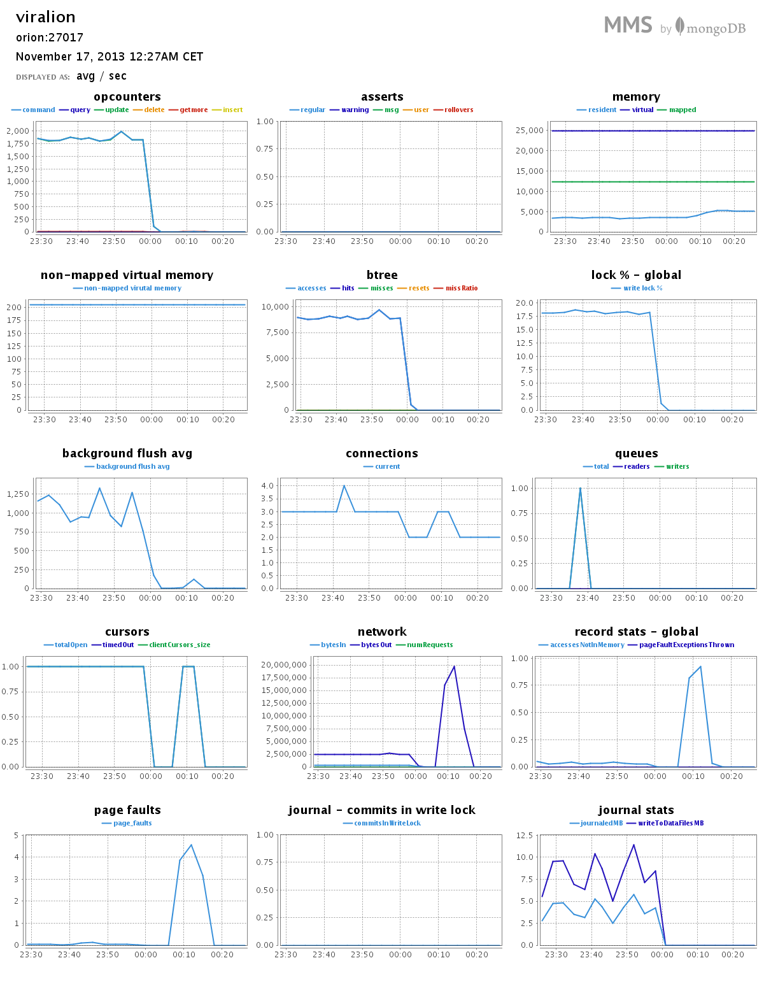
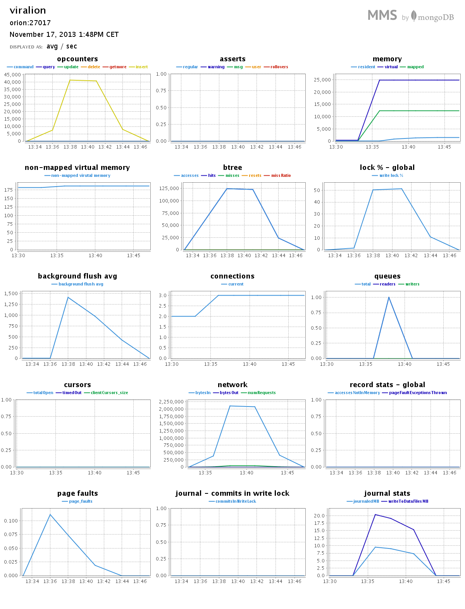

# Marcin Koźmiński #

[TOC]

## Platforma testowa ##

### Procesor ###
```sh
$ cat /proc/cpuinfo | grep 'model name'
model name  : Intel(R) Core(TM) i5-2410M CPU @ 2.30GHz
model name  : Intel(R) Core(TM) i5-2410M CPU @ 2.30GHz
model name  : Intel(R) Core(TM) i5-2410M CPU @ 2.30GHz
model name  : Intel(R) Core(TM) i5-2410M CPU @ 2.30GHz
```

### Pamięć ###
```sh
$ cat /proc/meminfo 
MemTotal:        6020356 kB
MemFree:         2933444 kB
Buffers:          114224 kB
Cached:          1540008 kB
SwapCached:        38116 kB
Active:          1849240 kB
Inactive:         994348 kB
Active(anon):    1148852 kB
Inactive(anon):   162360 kB
Active(file):     700388 kB
Inactive(file):   831988 kB
Unevictable:          32 kB
Mlocked:              32 kB
SwapTotal:       2097148 kB
SwapFree:        1905612 kB
Dirty:                76 kB
Writeback:             0 kB
AnonPages:       1162132 kB
Mapped:           159376 kB
Shmem:            121856 kB
Slab:             138744 kB
SReclaimable:     104232 kB
SUnreclaim:        34512 kB
KernelStack:        3672 kB
PageTables:        25864 kB
NFS_Unstable:          0 kB
Bounce:                0 kB
WritebackTmp:          0 kB
CommitLimit:     5107324 kB
Committed_AS:    4298784 kB
VmallocTotal:   34359738367 kB
VmallocUsed:      354664 kB
VmallocChunk:   34359380956 kB
HardwareCorrupted:     0 kB
AnonHugePages:         0 kB
HugePages_Total:       0
HugePages_Free:        0
HugePages_Rsvd:        0
HugePages_Surp:        0
Hugepagesize:       2048 kB
DirectMap4k:       62980 kB
DirectMap2M:     6137856 kB
```

### System ###
```sh
$ uname -a
Linux orion 3.11.0-13-generic #20-Ubuntu SMP Wed Oct 23 07:38:26 UTC 2013 x86_64 x86_64 x86_64 GNU/Linux
```

### MongoDB ###
```clean
$ mongo --version
MongoDB shell version: 2.4.8
```

### Storage ###
Skrypty były trzymane na systemowej partycji ext4 Linuksa. Natomiast pliki z danymi, ze względu na ich duży rozmiar, na partycji "wymiany danych" z systemem plików NTFS podmontowanej za pomocą ntfs-3g.

## Zadania ##

### Zadanie 1a ###

Zaimportować bazę `Train.csv` to lokalnej bazy Mongo.

#### Przygotowanie pliku CSV ####
Należało poprawić znaki końca linii występujące w pliku w wersji Windowsowej (`\r\n`) na Uniksową (`\n`). Plik `Train.csv` został potraktowany skryptem `2unix.sh`.
```sh
$ time ./scripts/mkozminski/2unix.sh data/mkozminski/Train.csv data/mkozminski/Train_prepared.csv 

real    16m39.549s
user    1m0.647s
sys     1m58.653s
```

#### Import ####
```sh
$ time mongoimport -c train --type csv --headerline --file data/mkozminski/Train_prepared.csv 
connected to: 127.0.0.1
Mon Nov 11 16:18:43.004         Progress: 40216027/7253917400   0%
Mon Nov 11 16:18:43.004             33200   11066/second
Mon Nov 11 16:18:46.005         Progress: 105538871/7253917400  1%
Mon Nov 11 16:18:46.005             87800   14633/second
...
Mon Nov 11 16:26:32.003         Progress: 7180166991/7253917400 98%
Mon Nov 11 16:26:32.004             5972900 12654/second
Mon Nov 11 16:26:35.055         Progress: 7241712381/7253917400 99%
Mon Nov 11 16:26:35.055             6024100 12682/second
Mon Nov 11 16:26:36.086 check 9 6034196
Mon Nov 11 16:26:36.348 imported 6034195 objects

real    7m56.529s
user    1m38.683s
sys     0m9.266s
```
Średnia prędkość ~12663 rekordów na sekundę.

##### Przemiał MongoDB #####


#### Rozmiar bazy danych ####
Rozmiar bazy danych przed importem:
```sh
$ du -hs /var/lib/mongodb/
3,1G    /var/lib/mongodb/
```

Rozmiar po imporcie
```sh
$ du -hs /var/lib/mongodb/
16G     /var/lib/mongodb/
```

### Zadanie 1b ###
Sprawdzić czy zaimportowano właściwą ilość rekordów.
```js
> db.train.count()
6034195
```
### Zadanie 1c ###
Zamienić string zawierający tagi na tablicę napisów z tagami następnie zliczyć wszystkie tagi i wszystkie różne tagi. Napisać program, który to zrobi korzystając z jednego ze sterowników.

#### Zamiana tagów ####
Aktualnie rekord w bazie wygląda następująco:
```json
{
    "_id" : 1,
    "title" : "How to check if an uploaded file is an image without mime type?",
    "body" : "<p>I'd like to check if an uploaded file is an image file (e.g 
        png, jpg, jpeg, gif, bmp) or another file. The problem is that I'm 
        using Uploadify to upload the files, which changes the mime type and 
        gives a 'text/octal' or something as the mime type, no matter which 
        file type you upload.</p>  <p>Is there a way to check if the uploaded 
        file is an image apart from checking the file extension using 
        PHP?</p> ",
    "tags" : "php image-processing file-upload upload mime-types"
}
```

Uruchomienie skryptu do zamiany tagów:
```sh
$ time python scripts/mkozminski/train_tags.py 
Transforming...
Done.

real    54m36.138s
user    19m39.489s
sys 3m50.958s
```

Po zamianie tagów wygląda następująco
```json
{
    "_id" : 1,
    "body" : "<p>I'd like to check if an uploaded file is an image file (e.g 
        png, jpg, jpeg, gif, bmp) or another file. The problem is that I'm 
        using Uploadify to upload the files, which changes the mime type and 
        gives a 'text/octal' or something as the mime type, no matter which 
        file type you upload.</p>  <p>Is there a way to check if the uploaded 
        file is an image apart from checking the file extension using 
        PHP?</p> ",
    "tags" : [
        "php",
        "image-processing",
        "file-upload",
        "upload",
        "mime-types"
    ],
    "title" : "How to check if an uploaded file is an image without mime type?"
}
```

##### Przemiał MongoDB #####
Interesujące nas dane znajdują się po godzinie 23:00.


#### Zliczanie tagów ####
```sh
$ time python scripts/mkozminski/train_count.py 
Counting...
Done.
All tags: 17409994
Unique tags: 42048

real    6m16.759s
user    1m17.499s
sys 0m12.733s
```

##### Przemiał MongoDB #####

Dzwinym trafem w trakcie zliczania nie pojawił się żaden pik na wykresie MMS. Powinien się pojawić w okolicach 00:10.

### Zadanie 1d ###
Ściągnąć plik text8.zip ze strony Matt Mahoney (po rozpakowaniu 100MB):

wget http://mattmahoney.net/dc/text8.zip -O text8.gz

Zapisać wszystkie słowa w bazie MongoDB. Następnie zliczyć liczbę słów oraz liczbę różnych słów w tym pliku. Ile procent całego pliku stanowi:

- najczęściej występujące słowo w tym pliku
- 10, 100, 1000 najczęściej występujących słów w tym pliku

Wskazówka: Zaczynamy od prostego EDA. Sprawdzamy, czy plik text8 zawiera wyłącznie znaki alfanumeryczne i białe:
```sh
$ tr --delete '[:alnum:][:blank:]' < text8 > deleted.txt
$ ls -l deleted.txt
  -rw-rw-r--. 1 wbzyl wbzyl 0 10-16 12:58 deleted.txt # rozmiar 0 -> OK
$ rm deleted.txt
```

```sh
$ tr --delete '[:alnum:][:blank:]' < data/mkozminski/text8 > data/mkozminski/deleted.txt
$ ls -l data/mkozminski/deleted.txt
-rw-r--r-- 1 viralion viralion 0 lis 17 13:23 data/mkozminski/deleted.txt
$ rm data/mkozminski/deleted.txt
```

Dopiero teraz wykonujemy te polecenia:

```sh
wc text8
  0         17005207 100000000 text8
tr --squeeze-repeats '[:blank:]' '\n' < text8 > text8.txt
wc text8.txt
  17005207  17005207 100000000 text8.txt  # powtórzone 17005207 -> OK
```

```sh
$ wc data/mkozminski/text8 
        0  17005207 100000000 data/mkozminski/text8
$ tr --squeeze-repeats '[:blank:]' '\n' < data/mkozminski/text8 > data/mkozminski/text8.txt
$ wc data/mkozminski/text8.txt 
 17005207  17005207 100000000 data/mkozminski/text8.txt
```

#### Import ####
```sh
$ time mongoimport -c text -f word --type csv --file data/mkozminski/text8.txt
connected to: 127.0.0.1
Sun Nov 17 13:35:18.173         Progress: 738122/100000000  0%
Sun Nov 17 13:35:18.173             123000  41000/second
Sun Nov 17 13:35:21.006         Progress: 1502861/100000000 1%
Sun Nov 17 13:35:21.006             251800  41966/second
...
Sun Nov 17 13:42:02.027         Progress: 98829610/100000000    98%
Sun Nov 17 13:42:02.027             16806700    41294/second
Sun Nov 17 13:42:05.115         Progress: 99620675/100000000    99%
Sun Nov 17 13:42:05.115             16941900    41321/second
Sun Nov 17 13:42:06.531 check 9 17005207
Sun Nov 17 13:42:07.003 imported 17005207 objects

real    6m51.274s
user    0m44.427s
sys     0m8.556s
```

##### Przemiał MongoDB #####


#### Agregacje ####
##### Ilość rekordów #####
```js
> db.text.count()
17005207
```

##### Ilość różnych słów #####
```js
> db.text.distinct("word").length
253854
```

##### Najczęściej występujące słowo #####
```js
> db.text.aggregate([
... {$group: {_id: '$word', count: {$sum: 1}}},
... {$sort: {count: -1}},
... {$limit: 1}
... ])
{ "result" : [ { "_id" : "the", "count" : 1061396 } ], "ok" : 1 }
```

###### Procent całości ######
```js
> 1061396 / db.text.count() * 100
6.241594118789616
```

##### Top 10 #####
```js
> db.text.aggregate([ {$group: {_id: '$word', count: {$sum: 1}}}, {$sort: {count: -1}}, {$limit: 10} ])
{
    "result" : [
        {
            "_id" : "the",
            "count" : 1061396
        },
        {
            "_id" : "of",
            "count" : 593677
        },
        {
            "_id" : "and",
            "count" : 416629
        },
        {
            "_id" : "one",
            "count" : 411764
        },
        {
            "_id" : "in",
            "count" : 372201
        },
        {
            "_id" : "a",
            "count" : 325873
        },
        {
            "_id" : "to",
            "count" : 316376
        },
        {
            "_id" : "zero",
            "count" : 264975
        },
        {
            "_id" : "nine",
            "count" : 250430
        },
        {
            "_id" : "two",
            "count" : 192644
        }
    ],
    "ok" : 1
}
```

###### Procent całości ######
```js
> db.text.aggregate([
... {$group: {_id: '$word', count: {$sum: 1}}},
... {$sort: {count: -1}},
... {$limit: 10},
... {$group: {_id: null, count: {$sum: '$count'}}}
... ])
{ "result" : [ { "_id" : null, "count" : 4205965 } ], "ok" : 1 }
> 4205965 / db.text.count() * 100
24.733394894869555
```

##### Top 100 #####
```js
> db.text.aggregate([ {$group: {_id: '$word', count: {$sum: 1}}}, {$sort: {count: -1}}, {$limit: 100} ])
{
    "result" : [
        {
            "_id" : "the",
            "count" : 1061396
        },
        {
            "_id" : "of",
            "count" : 593677
        },
...
        {
            "_id" : "up",
            "count" : 12445
        },
        {
            "_id" : "while",
            "count" : 12363
        },
        {
            "_id" : "where",
            "count" : 12347
        }
    ],
    "ok" : 1
}
```

###### Procent całości ######
```js
> db.text.aggregate([
... {$group: {_id: '$word', count: {$sum: 1}}},
... {$sort: {count: -1}},
... {$limit: 100},
... {$group: {_id: null, count: {$sum: '$count'}}}
... ])
{ "result" : [ { "_id" : null, "count" : 7998978 } ], "ok" : 1 }
> 7998978 / db.text.count() * 100
47.03840417820259
```

##### Top 1000 #####
```js
> db.text.aggregate([ {$group: {_id: '$word', count: {$sum: 1}}}, {$sort: {count: -1}}, {$limit: 1000} ])
{
    "result" : [
        {
            "_id" : "the",
            "count" : 1061396
        },
        {
            "_id" : "of",
            "count" : 593677
        },
...
        {
            "_id" : "element",
            "count" : 1787
        },
        {
            "_id" : "appears",
            "count" : 1786
        },
        {
            "_id" : "takes",
            "count" : 1783
        },
        {
            "_id" : "fall",
            "count" : 1783
        }
    ],
    "ok" : 1
}
```

###### Procent całości ######
```js
> db.text.aggregate([
... {$group: {_id: '$word', count: {$sum: 1}}},
... {$sort: {count: -1}},
... {$limit: 1000},
... {$group: {_id: null, count: {$sum: '$count'}}}
... ])
{ "result" : [ { "_id" : null, "count" : 11433354 } ], "ok" : 1 }
> 11433354 / db.text.count() * 100
67.23443001899359
```

### Zadanie 1e ###
Wyszukać w sieci dane zawierające obiekty GeoJSON. Zapisać dane w bazie MongoDB.

Dla zapisanych danych przygotować 6–9 różnych Geospatial Queries (co najmniej po jednym dla obiektów Point, LineString i Polygon). W przykładach należy użyć każdego z tych operatorów: $geoWithin, $geoIntersect, $near.

#### Dane ####
Moimi danymi jest baza polskich miejscowości złożona z danych pobranych z [Wikipedii](http://pl.wikipedia.org/wiki/Wikipedia:Skarbnica_Wikipedii/Po%C5%82o%C5%BCenie_miejscowo%C5%9Bci). Pierwotnie doprowadzona do formatu csv ([cities.csv](../../data/mkozminski/cities.csv)). Następnie została przekształcona na odpowiednie obiekty JSON ([cities.json](../../data/mkozminski/cities.json)) za pomocą skrytpu [cities_rewrite.py](../../scripts/mkozminski/cities_rewrite.py).

Przykładowy rekord CSV:
```csv
name,lat_deg,lat_min,lon_deg,lon_min
Abramowice Kościelne,51,12,22,35
```

Ten sam rekord jako JSON:
```json
{
    "_id": 1, 
    "loc": {
        "coordinates": [
            22.583333333333332, 
            51.2
        ], 
        "type": "Point"
    }, 
    "name": "Abramowice Kościelne"
}
```