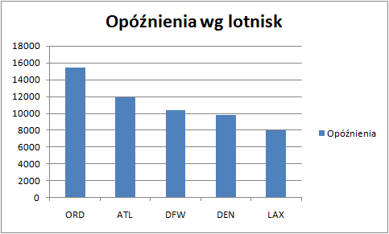
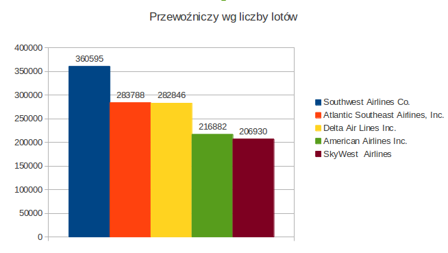

<h1>Zadanie2</h2>


Dane do zadania 2 pochodzą ze strony www.transtats.bts.gov/DL_SelectFields.asp?Table_ID=236&DB_Short_Name=On-Time
Dotyczą ruchu powietrznego na terenie USA w pierwszym kwartale 2013 roku. Dane na stronie podzielone są według miesięcy.

<h2>Mongodb</h2>

<h3>Import danych</h3>

Import danych ze stycznia 2013:
```sh
	time mongoimport -d traffic -c air -type csv --headerline -file 433312457_T_ONTIME_2013_1.csv <br />
	...
	Sun Dec  8 15:53:20.849 check 9 509520
	Sun Dec  8 15:53:21.112 imported 509519 objects
	
	real	1m6.898s
	user	0m39.148s
	sys	0m1.692s
```
Import danych z lutego 2013:
```sh
	time mongoimport -d traffic -c air -type csv --headerline -file 433314029_T_ONTIME_2013_2.csv <br />
	...
	Sun Dec  8 15:58:24.691 check 9 469747
	Sun Dec  8 15:58:25.012 imported 469746 objects
	
	real	1m2.581s
	user	0m35.540s
	sys	0m1.536s
```
Import danych z marca 2013:
```sh
	time mongoimport -d traffic -c air -type csv --headerline -file 433314029_T_ONTIME_2013_3.csv 
	...
	Sun Dec  8 16:02:19.943 check 9 552313
	Sun Dec  8 16:02:20.327 imported 552312 objects
	
	real	1m13.893s
	user	0m42.136s
	sys	0m1.840s
```
Sprawdzenie liczby rekordów:
```sh
	> use traffic
	switched to db traffic
	> db.air.count()
	1531577
```
Przykładowy rekord:	
```sh
	> db.air.findOne()
	{
		"_id" : ObjectId("52a4879ea57524964ba8e4d7"),
		"QUARTER" : 1,
		"MONTH" : 1,
		"FL_DATE" : "2013-01-17",
		"AIRLINE_ID" : 20363,
		"CARRIER" : "9E",
		"TAIL_NUM" : "N923XJ",
		"ORIGIN_AIRPORT_ID" : 11298,
		"ORIGIN" : "DFW",
		"ORIGIN_CITY_NAME" : "Dallas/Fort Worth, TX",
		"DEST_AIRPORT_ID" : 12478,
		"DEST" : "JFK",
		"DEST_CITY_NAME" : "New York, NY",
		"DEP_DEL15" : 0,
		"DEP_DELAY_GROUP" : -1,
		"ARR_DEL15" : 0,
		"ARR_DELAY_GROUP" : -1,
		"CANCELLED" : 0,
		"DIVERTED" : 0,
		"AIR_TIME" : 175,
		"DISTANCE" : 1391,
		"CARRIER_DELAY" : "",
		"WEATHER_DELAY" : "",
		"NAS_DELAY" : "",
		"SECURITY_DELAY" : "",
		"LATE_AIRCRAFT_DELAY" : "",
		"" : ""
```
	
<h3>Pierwsza agregacja</h3>

Największa liczba opóźnien odlotów (powyżej 15 minut) według lotniska:

	db.air.aggregate(
	 {$group : 
	 { _id : { _id : "$DEST", city : "$DEST_CITY_NAME" }, 
	 total_delays : { $sum : "$DEP_DEL15" } } }, 
	 { $sort : {total_delays : -1 } }, 
	 { $limit : 5 } )
 
Wynik:

	{
		"result" : [
			{
				"_id" : {
					"_id" : "ORD",
					"city" : "Chicago, IL"
				},
				"total_delays" : 15392
			},
			{
				"_id" : {
					"_id" : "ATL",
					"city" : "Atlanta, GA"
				},
				"total_delays" : 11942
			},
			{
				"_id" : {
					"_id" : "DFW",
					"city" : "Dallas/Fort Worth, TX"
				},
				"total_delays" : 10406
			},
			{
				"_id" : {
					"_id" : "DEN",
					"city" : "Denver, CO"
				},
				"total_delays" : 9823
			},
			{
				"_id" : {
					"_id" : "LAX",
					"city" : "Los Angeles, CA"
				},
				"total_delays" : 8033
			}
		],
		"ok" : 1
	}
		
W pierwszym kwartale 2013 roku najwięcej opóźnien miały lotniska:
```sh
	1. O'Hare International Airport Chicago (ORD): 15392 
	2. Hartsfield-Jackson Atlanta International Airport (ATL): 11942
	3. Dallas/Fort Worth Internationa Airport (DFW): 10406
	4. Denver International Airport (DEN): 9823
	5. Los Angeles International Airport (LAX): 8033
```



<h3>Druga agregacja</h3>

Najwiecej minut w powietrzu według samolotu.
 
	 db.air.aggregate(
	 {$group : 
	 { _id : "$TAIL_NUM", 
	 total_air_time : { $sum : "$AIR_TIME" } } }, 
	 { $sort : {total_air_time : -1 } }, 
	 { $limit : 5 } )
 
Wynik:

	 {
		"result" : [
			{
				"_id" : "N76065",
				"total_air_time" : 74611
			},
			{
				"_id" : "N77066",
				"total_air_time" : 65336
			},
			{
				"_id" : "N750AT",
				"total_air_time" : 63626
			},
			{
				"_id" : "N5FCAA",
				"total_air_time" : 63253
			},
			{
				"_id" : "N751AT",
				"total_air_time" : 62866
			}
		],
		"ok" : 1
	}

W pierwszym kwartale 2013 roku najwięcej minut w powietrzu spędziły samoloty:
```sh
	1. N76065 - 74611 minut
	2. N77066 - 65336 minut
	3. N750AT - 63626 minut
	4. N5FCAA - 63253 minut
	5. N751AT - 62866 minut
```


<h2>Elastic Search</h2>

<h3>Import danych</h3>
Dane na stronie www.transtats.bts.gov/DL_SelectFields.asp?Table_ID=236&DB_Short_Name=On-Time dostępne są w formacie CSV. W celu otrzymania ich w formacie json wykonano eksport z bazy mongodb.
```sh
mongoexport -d traffic -c air -o flights.json
```
Do importu danych uzyto Bulk API. Bulk API wymaga danych typu bulk.
Zamiana danych na typ bulk za pomocą programu jq:
```sh
time cat flights.json | jq --compact-output '{ "index": { "_type": "flight" } }, .'  > flights.bulk

real	5m20.949s
user	3m38.996s
sys	0m32.340s
```

Próba importu danych w całości:
```sh
time curl -s -XPOST localhost:9200/data/_bulk --data-binary @flights.bulk

real	0m21.192s
user	0m0.224s
sys	0m1.144s
```
Próba zakończyła się niepowodzeniem:
```sh
org.elasticsearch.common.netty.handler.codec.frame.TooLongFrameException: HTTP content length exceeded 104857600 bytes.
```

Podział danych na części i import po podziale:
```sh
split -l 200000 flights.bulk
time for i in x*; do curl -s -XPOST   localhost:9200/data/_bulk --data-binary @$i; done

real	14m4.265s
user	0m1.208s
sys	0m3.860s
```

Sprawdzenie danych po imporcie:
```sh
curl -XGET 'http://localhost:9200/data/flight/_count' ; echo
{"count":2231577,"_shards":{"total":5,"successful":5,"failed":0}}
``` 

<h3>Pierwsza agregacja</h3>

Liczba lotów według przewoźnika. Lista 5 przewoźników z największą liczbą lotów:

```sh
curl -X POST "http://localhost:9200/data/_search?pretty=true" -d '
{
    "query" : {
        "match_all" : {  }
    },
    "facets" : {
        "CARRIER" : {
            "terms" : {
                "field" : "CARRIER",
                "size" : 5
            }
        }
    }
}
```

Wynik:

```sh
  "facets" : {
    "CARRIER" : {
      "_type" : "terms",
      "missing" : 58528,
      "total" : 2173049,
      "other" : 822008,
      "terms" : [ {
        "term" : "wn",
        "count" : 360595
      }, {
        "term" : "ev",
        "count" : 283788
      }, {
        "term" : "dl",
        "count" : 282846
      }, {
        "term" : "aa",
        "count" : 216882
      }, {
        "term" : "oo",
        "count" : 206930
      } ]
    }
  }
}
```
Sprawdzając po kodzie przewoźnika, największą liczbę lotów wykonali:

```sh
Southwest Airlines Co. - 360595 lotów
Atlantic Southeast Airlines, Inc. - 283788 lotów
Delta Air Lines Inc. - 282846 lotów
American Airlines Inc. - 216882 lotów
SkyWest  Airlines - 206930 lotów
```



<h3>Druga agregacja</h3>

